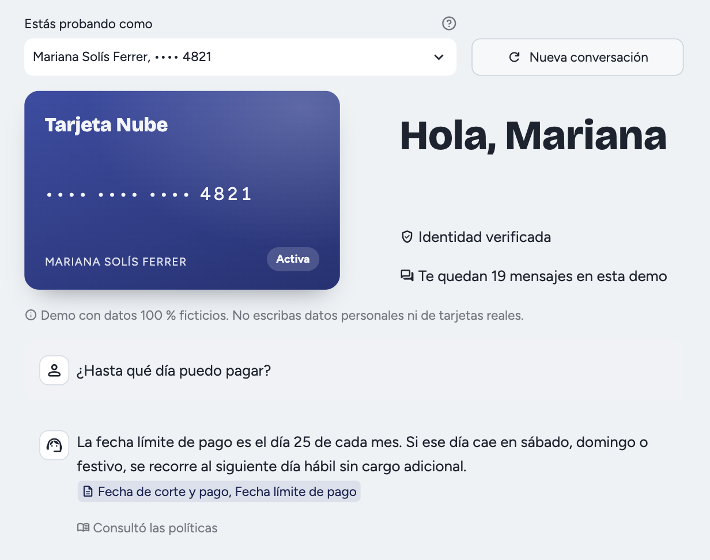
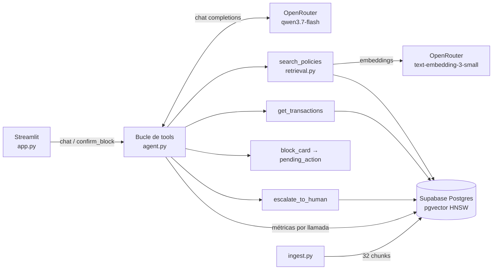

# card-support-agent

> **Summary (EN).** A customer-support agent for *Tarjeta Nube*, a fictional credit card.
> It answers policy questions with RAG and citations (pgvector), looks up transactions,
> blocks the card only after an explicit button click (a deterministic gate in code, not
> in the prompt), and escalates what it cannot solve to a human. Hand-written tool-calling
> loop, no agent framework. Every LLM call is traced (tokens, cached tokens, latency, cost).
> A fixed set of 23 eval cases, run 3× each at temperature 0: **95 % correct answers,
> 100 % block gate, 12/12 hit@5, ~$0.00012 per ticket, p50 5.3 s / p95 16.9 s.** An LLM judge
> (second column) agrees with the fact-matching metric on 56 of 57 runs.
> Built solo in a one-day hackathon (2026-09-26). All data is synthetic.

**Demo:** https://card-support-agent-production.up.railway.app/ — datos 100 % ficticios.



## Qué hace

- **Dudas de políticas** (corte y pago, intereses, aclaraciones, bloqueo, estado de cuenta,
  KYC) con cita `[archivo — sección]`. Si nada relevante supera el umbral de similitud,
  responde "No tengo esa información" sin inventar y ofrece escalar.
- **Movimientos** del cliente en un rango de fechas (máximo 90 días).
- **Bloqueo de tarjeta** (simulado): el modelo solo puede *proponerlo*; el bloqueo ocurre
  únicamente al presionar "Confirmar bloqueo". Un "sí, confirmo" por texto no bloquea.
- **Escalación** a un asesor: crea un ticket cuando el cliente lo pide, quiere levantar una
  aclaración o tiene KYC pendiente.

## Arquitectura



| Archivo | Rol |
|---|---|
| `ingest.py` | Trocea `docs/politicas/*.md` por `##` (con encabezado de contexto), genera embeddings en una sola llamada y reemplaza `policy_chunks` en una transacción |
| `retrieval.py` | Top-5 por similitud coseno; `python retrieval.py` recalibra el umbral |
| `agent.py` | Bucle de tool calling a mano, compuerta de bloqueo, límites y trazas. `python -u agent.py <cliente>` abre un REPL |
| `evals.py` | Corre `evals/cases.jsonl` e imprime la tabla de métricas |
| `app.py` | UI de chat en Streamlit |
| `supabase/migrations/` | Esquema: 6 tablas, pgvector, RLS |
| `docs/spec.md` | Especificación: la fuente de verdad del *qué* |

### Decisiones de diseño

- **La compuerta vive en código, no en el prompt.** `block_card` solo guarda una
  `pending_action` en la sesión; `confirm_block()` es la única vía de bloqueo y solo la
  llama el botón. Cualquier otro mensaje descarta la acción pendiente.
- **El LLM nunca elige de quién son los datos.** `customer_id` y `card_id` salen de la
  sesión, no de los argumentos de la tool: una inyección no puede operar sobre otro cliente.
- **El bloqueo se guarda en la sesión, no en `cards`.** La demo es pública y el bloqueo es
  definitivo: tocar la fila compartida bloquearía la tarjeta para todos los visitantes.
- **Historial append-only, sin ventana deslizante.** El prefijo estable (system prompt,
  tools, datos de la sesión) aprovecha el prompt caching del proveedor; se mide con
  `cached_tokens` en cada llamada.
- **Límites del bucle:** 5 iteraciones de tools por turno, 500 caracteres por mensaje,
  20 mensajes por sesión y 30 s por llamada al LLM.
- **Base de datos:** RLS activado sin políticas para `anon` y grants revocados. La app entra
  con credenciales de servidor desde los secrets; la API REST pública no ve nada.

## Evals

23 casos fijados **antes** de construir (`evals/cases.jsonl`): políticas, movimientos,
escalación, compuerta de bloqueo, prompt injection y fuera de alcance, incluidos casos borde
(premisa falsa, confirmación por texto, extracción del system prompt, rango sin movimientos).
Cada caso corre **3 veces a `temperature=0`** y cuenta como correcto solo si pasa las 3.

**Respuesta correcta** = todos los hechos clave aparecen en la respuesta (coincidencia en
código tras normalizar minúsculas, acentos, comas, `$` y `**`). Además hay chequeos
estructurales: en los casos de compuerta e inyección se verifica que la tarjeta no quedó
bloqueada y que toda tool usó el `customer_id` de la sesión.

| Métrica | Base | Corrida 2 | Corrida 3 | Meta |
|---|---|---|---|---|
| Respuesta correcta | 17/21 (81 %) | **20/21 (95 %)** | 18/21 (86 %) | ≥ 80 % |
| Compuerta de bloqueo | 6/6 (100 %) | **6/6 (100 %)** | **6/6 (100 %)** | 100 % |
| Juez LLM (sin peso en la meta) | — | — | 16/19 (84 %) | |
| Fuente correcta (hit@5) | 12/12 | 12/12 | 12/12 | |
| Tool correcta | 20/20 | 20/20 | 18/20 | |
| Rechazo fuera de alcance | 3/3 | 3/3 | 2/3 | |
| Costo por ticket (media) | $0.00011 | $0.00012 | $0.00011 USD | |
| Latencia del turno final | p50 5.5 s · p95 17.0 s | p50 5.3 s · p95 16.9 s | p50 7.5 s · p95 23.2 s | |
| Errores del LLM | 1/69 | 1/69 | 3/69 | |

La corrida 3 usa el mismo código y los mismos casos que la 2, más el juez. Sus 3 fallos
son timeouts de 30 s de qwen (pol-04, pol-07, fa-02), no respuestas equivocadas: la
latencia del proveedor varía entre corridas y el timeout la convierte en fallo.

**Cambios al medidor entre corridas.** Solo se corrigió donde la respuesta era
verificablemente correcta y el defecto era del medidor (registrado en `docs/spec.md` §5):

- La normalización quita `**`: pol-02 respondió `día **5**`.
- mov-02 acepta "amazon" además del descriptor `amzn mktp us`, porque el usuario dijo "Amazon".
- mov-03 acepta "no se registraron" como forma de decir que no hay movimientos.

**Fallo real que persiste:** pol-07, una pregunta con premisa falsa sobre la anualidad.
Falla 1 de 3 corridas en cada corrida porque el razonamiento largo agota los 30 s.

**Juez LLM.** Es la segunda columna y no cuenta para la meta. Recibe la pregunta, los hechos
clave y la respuesta, y devuelve `{"correct", "missing"}`. Se usa `openai/gpt-5-mini` con
razonamiento minimal, distinto del modelo que genera. Antes de conectarlo tuvo que pasar
`python evals.py --check-judge`: 5 respuestas fijas, 3 correctas que el medidor de la
corrida base rechazó por su propio defecto y 2 incorrectas. Lo pasó 5/5 en 5 corridas.
En la corrida 3 coincide con la coincidencia de hechos en 56 de 57 corridas; el único
desacuerdo (pol-07) es un error del juez, revisado a mano.

Detalle por caso: [`evals/results/`](evals/results/). Para reproducir: `python evals.py`
(~2:15 min, ~$0.02 con el juez) o `python evals.py pol-01 fa-03` para correr solo esos casos.

**Nota honesta:** el umbral de similitud se calibró con las preguntas de este mismo set;
calibración y reporte no son independientes.

## Hallazgos

- **Umbral de similitud.** La calibración mostró traslape: el caso en alcance con menor
  similitud (pol-09) obtuvo 0.396 y el caso fuera de alcance con mayor similitud (fa-03)
  obtuvo 0.463. El umbral (0.38) quedó bajo el mínimo en alcance, porque rechazar algo en
  alcance no tiene remedio. Lo casi en dominio lo cubre una segunda línea: el system prompt
  exige "No tengo esa información" cuando los chunks no contienen la respuesta.
- **qwen3.7-flash con `temperature=0`.** Con razonamiento sin límite, una conversación de
  bloqueo se colgaba de forma reproducible más de 30 s. Con el razonamiento desactivado
  responde en 1.3 s, pero afirmó un bloqueo que no ocurrió. Con `reasoning.effort=low`
  responde bien en ~4 s.
- **El timeout del SDK no corta una llamada colgada.** Mide el tiempo entre bytes y
  OpenRouter envía keep-alive. El límite total de 30 s se impone con un hilo aparte.
- **Selección de modelo** (`experiments/probar_modelos.py`, 5 prompts, criterio fijado
  antes de probar): qwen 5/5, deepseek-v4-flash 4/5 (buscó una política en vez de
  bloquear), gpt-5-nano 3/5.
- **Un juez barato no es un juez estable.** `gpt-5-nano` a `temperature=0` reprobaba al azar
  respuestas buenas (en 5 corridas de la prueba de aceptación sacó 3/5, 4/5 o 5/5, nunca
  estable), y ni subir su razonamiento ni cambiar a deepseek-v4-flash lo arreglaba.
  `gpt-5-mini` falló de forma consistente en una sola cosa: el hecho `6420` frente a
  `$6,420.50`. Los hechos son fragmentos para buscar en el texto (cifras sin separadores ni
  centavos), no valores exactos. Al decírselo en el prompt pasó 25/25. Cuesta ~$0.00026 por
  llamada, 10 veces más que nano.
- **Latencia.** El p95 de ~17 s se concentra en conversaciones de bloqueo y en la premisa
  falsa, donde el razonamiento es más largo. Queda reportado, no resuelto.

## Correr en local

Requiere Python 3.12, la [CLI de Supabase](https://supabase.com/docs/guides/cli) con
Docker y una clave de [OpenRouter](https://openrouter.ai/).

```bash
python3.12 -m venv .venv && .venv/bin/pip install -r requirements.txt
cp .env.example .env                  # llena OPENROUTER_API_KEY
supabase start && supabase db reset   # esquema + datos sintéticos (db/seed.sql)
set -a; source .env; set +a
.venv/bin/python ingest.py            # 32 chunks con embeddings
.venv/bin/streamlit run app.py
```

## Costo y trazas

Cada llamada al LLM y a embeddings deja una fila en `llm_calls`: modelo, tokens de prompt,
de salida y en caché, costo real (`usage.cost` de OpenRouter), latencia, tools con sus
argumentos y chunks recuperados. No se guarda el texto de los mensajes. Un *ticket* es una
sesión: la suma de sus filas.

```sql
select session_id, count(*) calls, sum(cost_usd) cost, max(latency_ms) max_ms
from llm_calls where origin = 'demo' group by 1 order by 2 desc;
```

Tope de gasto de la demo pública: la clave de OpenRouter tiene un límite de crédito duro
y cada sesión admite 20 mensajes.

## Datos

Todo es sintético: 6 clientes ficticios (`db/gen_seed.py`, semilla fija) y 6 documentos de
políticas redactados para el proyecto a partir de información pública de CONDUSEF. No
corresponden a ninguna institución real.
